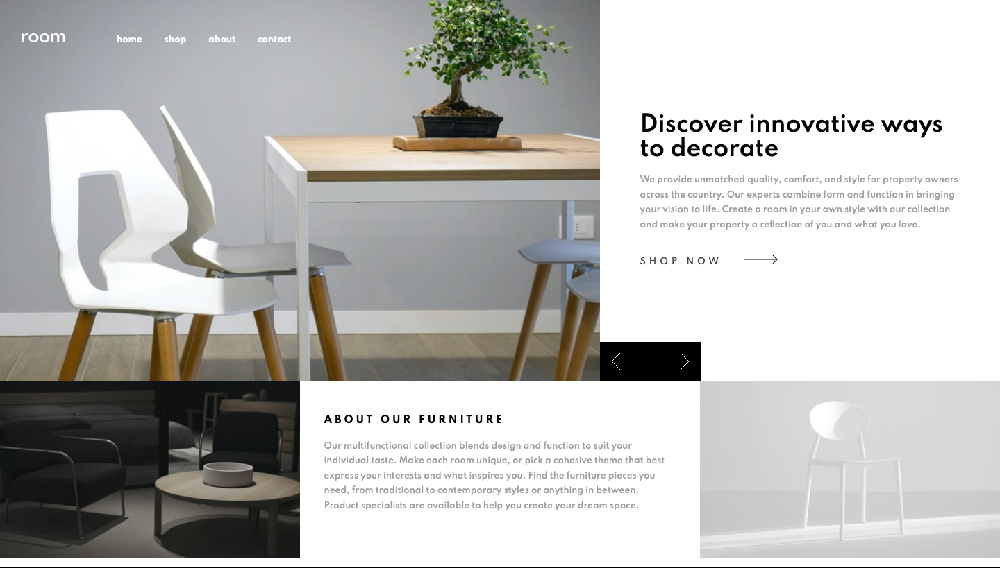
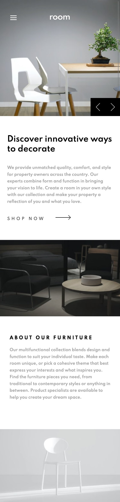

# Frontend Mentor - Room homepage solution

This is a solution to the [Room homepage challenge on Frontend Mentor](https://www.frontendmentor.io/challenges/room-homepage-BtdBY_ENq). Frontend Mentor challenges help you improve your coding skills by building realistic projects. 

## Table of contents

- [Overview](#overview)
  - [The challenge](#the-challenge)
  - [Screenshot](#screenshot)
  - [Links](#links)
- [My process](#my-process)
  - [Built with](#built-with)
  - [What I learned](#what-i-learned)
  - [Continued development](#continued-development)
  - [Useful resources](#useful-resources)
- [Author](#author)
- [Acknowledgments](#acknowledgments)

**Note: Delete this note and update the table of contents based on what sections you keep.**

## Overview

### The challenge

Users should be able to:

- View the optimal layout for the site depending on their device's screen size
- See hover states for all interactive elements on the page
- Navigate the slider using either their mouse/trackpad or keyboard

### Screenshot

### Links

- Solution URL: [https://github.com/techmeg/room-homepage](https://github.com/techmeg/room-homepage)
- Live Site URL: [https://techmeg.github.io/room-homepage/](https://techmeg.github.io/room-homepage/)

## My process

### Built with

- Semantic HTML5 markup
- Flexbox
- CSS Grid
- Sass
- Mobile-first workflow
- JS

### What I learned

Although I have used Sass on existing production projects, I had not set it up on a local project. I used Live Sass Compiler, which was fine. Might use Parcel in future, more to learn. Since it's a small project I didn't really exploit all the benefits of Sass, but it was nice to get free -webkit and -ms instructions.

I did not think all the way through the problems of the vertical to horizontal switch from mobile to desktop and initially made a slider, so after alot of futzing with translateX I ended up just placing content from JS.

I wasn't sure how to select the right crop of image when dynamically changing the window size, but did a little googling to find window.onresize and then made the function to select the right image apply to window.onload.

### Continued development

The colors outlined in the styleguide resulted in poor color contrast that did not meet a11y requirements. I left them as is. I could not quite get the white space around the feature copy content to match the design without bad things happening during window resize, so I went with what worked responsively.

## Author

- Website - [techmeg](https://techmeg-portfolio.netlify.app/)
- Frontend Mentor - [@techmeg](https://www.frontendmentor.io/profile/techmeg)

## Acknowledgments
I have lost track of the project I peeked at for guidance, but did get some guidance from another solution.

